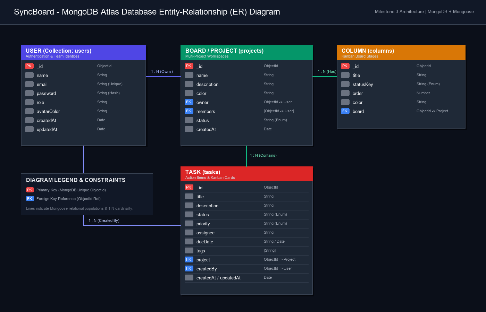
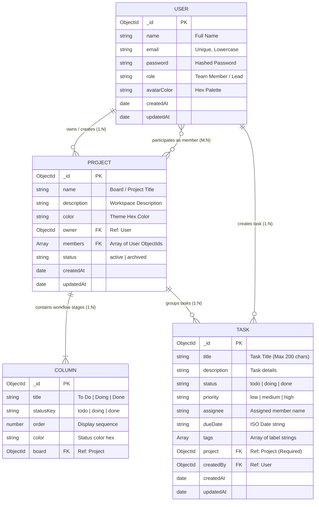
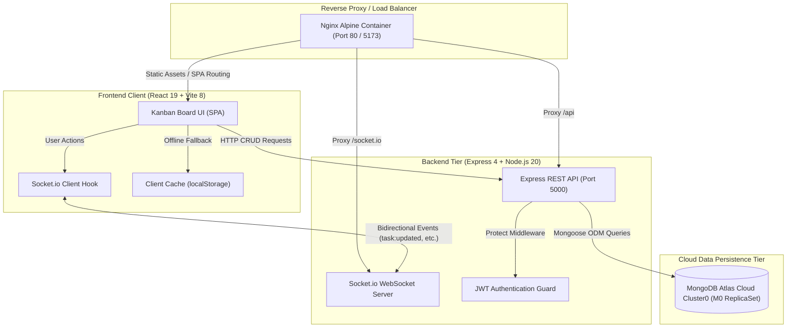

# SyncBoard / CollabBoard — Team Task Board (Milestone 3 - MongoDB Atlas & Multi-Project)

SyncBoard (working title: CollabBoard) is a production-ready, full-stack collaborative Kanban-style task management web application designed for software development teams to organize, track, and manage complex multi-project workflows efficiently.

This repository represents **Milestone 3 (M3 — Cloud Database Persistence with MongoDB Atlas & Multi-Project Kanban Support)**.

---

## 🚀 Key Features (Milestone 3)

- **Multiple Projects Support**: Create and manage multiple project boards simultaneously (e.g. *Project Alpha*, *Mobile App*, *E-Commerce Engine*) with dedicated task scopes.
- **Dynamic Project Switcher**: Interactive project dropdown in Navbar with real-time project switching and custom project color coding.
- **Persistent Cloud Database**: Fully integrated with **MongoDB Atlas Cloud Cluster** via **Mongoose ODM** with schemas for `User`, `Project`, and `Task`.
- **JWT Authentication & Profile Management**: Secure registration, login authentication, password hashing, and role-based user profiles stored in MongoDB Atlas.
- **RESTful API Architecture**: Complete set of CRUD endpoints for Auth (`/api/auth`), Projects (`/api/projects`), and Tasks (`/api/tasks`).
- **Real-Time Kanban Interaction**: Move tasks smoothly across columns (`To Do`, `Doing`, `Done`), with instant progress calculation and metrics.
- **Postman Collection v3 Export**: Full collection with pre-configured requests, environment variables, and authentication tokens (`server/postman/SyncBoard_API_Collection_v3.json`).

---

## 🛠️ Tech Stack Details

| Layer | Technologies |
| :--- | :--- |
| **Frontend Client** | React 19, Vite 8, Vanilla CSS (Glassmorphic Dark Theme), Lucide Icons |
| **Backend Server** | Node.js (ES Modules), Express.js REST API |
| **Database & ODM** | MongoDB Atlas (Free Tier M0 ReplicaSet), Mongoose ODM |
| **Security & Auth** | JSON Web Tokens (JWT), Bearer Token Middleware, CORS, Dotenv |
| **API Testing & Docs** | Postman Collection v3 JSON |

---

## 📋 Prerequisites

Before running this project, ensure you have:
- **Node.js** v18.0.0 or higher (`node -v`)
- **npm** v9.0.0 or higher (`npm -v`)
- Active internet connection (to connect to the remote MongoDB Atlas cluster)

---

## ⚙️ Environment Configuration

The backend requires environment variables defined in `server/.env`:

```env
PORT=5000
JWT_SECRET=syncboard_jwt_secret_2026_collabboard
MONGO_URI=mongodb+srv://<username>:<password>@cluster0.4820k0e.mongodb.net/syncboard?retryWrites=true&w=majority&appName=Cluster0
NODE_ENV=development
```

---

## 💻 How to Run the Application (Step-by-Step)

### Step 1: Start Express Backend Server (Terminal 1)
```bash
# Navigate to server directory
cd server

# Install backend dependencies
npm install

# (Optional) Seed demo users, projects, and tasks into MongoDB Atlas
npm run seed

# Start the server
npm start
```
*Backend server runs at: `http://localhost:5000/api`*  
*Terminal displays: `MongoDB Atlas Connected: ac-j496tuj-shard-00-01.4820k0e.mongodb.net`*

### Step 2: Start React Frontend Client (Terminal 2)
```bash
# Navigate to client directory
cd client

# Install frontend dependencies
npm install

# Start Vite development server
npm run dev
```
*Frontend opens at: `http://localhost:5173/`*

---

## 🔑 Demo Login Accounts

All accounts are pre-seeded in the MongoDB Atlas database:

| Name | Role | Email | Password |
| :--- | :--- | :--- | :--- |
| **Sandeepa Ilangasingha** | Team Lead & Full-Stack Dev | `sandeepa@example.com` | `password123` |
| **Amara Fernando** | UI/UX Designer | `amara@example.com` | `password123` |
| **Kasun Perera** | Frontend Engineer | `kasun@example.com` | `password123` |
| **Nirman Jayarathna** | Backend Architect | `nirman@example.com` | `password123` |

*(You can also use the **Register** page to create your own account dynamically stored in MongoDB Atlas).*

---

## 📁 Full-Stack Project Structure

```text
collabboard/
├── client/                          # React Frontend Client (Port 5173)
│   ├── src/
│   │   ├── components/             # Navbar, Board, Column, TaskCard, Modal, ProjectModal
│   │   ├── context/                # AuthContext (JWT State Management)
│   │   ├── pages/                  # LoginPage, RegisterPage, BoardPage
│   │   ├── services/               # api.js (REST API integration service)
│   │   └── styles/                 # Glassmorphic CSS design system
│   └── package.json
│
└── server/                          # Node.js Express REST API (Port 5000)
    ├── src/
    │   ├── config/                 # db.js (Atlas connection with DNS fallback), env.js
    │   ├── controllers/            # authController.js, projectController.js, taskController.js
    │   ├── middleware/             # authMiddleware.js (JWT Bearer Guard)
    │   ├── models/                 # User.js, Project.js, Task.js (Mongoose Schemas)
    │   ├── routes/                 # authRoutes.js, projectRoutes.js, taskRoutes.js
    │   ├── seed.js                 # Database Seeder script
    │   └── server.js               # Express application entry point
    ├── postman/                    # SyncBoard_API_Collection_v3.json
    ├── .env                        # Atlas connection & JWT configuration
    └── package.json
```

---

---

## 📊 Database Schema & Entity-Relationship (ER) Diagram (Milestone 3 - Step 5)

The application models its persistent data in MongoDB Atlas using Mongoose ODM with strong referential integrity, foreign keys, timestamps, and schema validations across four interconnected collections:



### Mermaid Entity-Relationship (ER) Definition:



---

## ⚡ Client-Side Caching & Network Drop Resilience (Milestone 3 - Step 6)

SyncBoard integrates client-side storage (`localStorage`) in the React frontend to maintain high availability and seamless user experience during brief network drops or temporary server disconnects:

1. **Board State Caching**:
   - Whenever projects or board tasks are fetched from MongoDB Atlas, they are serialized and cached in client-side storage (`syncboard_cached_projects` and `syncboard_cached_tasks_<projectId>`).
   - If a network drop occurs (`navigator.onLine === false` or API network failure), the board seamlessly loads and renders from the client cache, displaying an informative banner:
     `📶 Client-Side Caching Active (Step 6): Displaying locally cached board state from localStorage.`

2. **In-Progress Work Safeguarding (Draft Caching)**:
   - When drafting a new task in `TaskForm`, every keystroke is preserved in local storage under `syncboard_task_draft`.
   - If the user accidentally closes the browser tab or loses connection, the in-progress work is automatically restored when reopening the dialog.

3. **Offline State Persistence & Auto-Reconnection**:
   - Status changes and task edits made during temporary drops update the local cache immediately.
   - The application listens to `window.addEventListener('online')` to automatically reconnect and re-sync with MongoDB Atlas once connection is restored.

---

## 🛠️ Database Connection & Troubleshooting Guide

If a teammate or evaluator encounters a **MongoDB Connection Error**, check the following common causes:

1. **Missing `.env` file after `git clone`**:
   - Because `.env` is git-ignored for credential security, fresh clones do not automatically contain `server/.env`.
   - **Fix**: Copy `server/.env.example` to `server/.env`, or start the server directly; `server/src/config/env.js` contains an automatic fallback to the live Atlas cluster.

2. **DNS SRV Resolution Issues on Windows / Specific ISPs**:
   - Some local routers or ISPs block port 53 SRV DNS queries (`_mongodb._tcp.cluster0...`), causing `querySrv ECONNREFUSED`.
   - **Fix**: The backend in `server/src/config/db.js` is pre-configured with Google DNS (`8.8.8.8`) resolver and an automated fallback to the direct 3-host ReplicaSet URI (`DIRECT_REPLICA_URI`) on standard port 27017.

3. **Network Access / IP Whitelist on Atlas**:
   - The cluster is configured with `0.0.0.0/0` (Allow access from anywhere), allowing connections from any location worldwide.

## 🏷️ Release Tags
- `v1.0.0-m1`: Milestone 1 — Static Front-End Skeleton
- `v2.0.0-m2`: Milestone 2 — Working REST APIs Integrated with Frontend
- `v3.0.0-m3`: Milestone 3 — MongoDB Atlas Cloud Persistence & Multiple Projects

---

## 🏛️ System Architecture Diagram (Session 5 - DevOps & Real-Time)

SyncBoard employs an event-driven, full-stack client-server architecture with dual communication protocols (REST over HTTP for persistent transactional operations, and WebSockets via Socket.io for instantaneous multi-user state synchronization):



---

## ⚡ Real-Time Engine & Live Multi-User Synchronization (Session 5 - Criterion 5)

SyncBoard features full real-time collaboration powered by **Socket.io**:
- **Project-Scoped Rooms**: When a user switches projects, their socket client automatically joins `project_<projectId>`.
- **Live Event Propagation**:
  - `task:created`: Instantly renders newly created tasks on all connected teammate screens without manual page refresh.
  - `task:updated`: Broadcasts drag-and-drop column moves (`todo` ➔ `doing` ➔ `done`), title changes, and assignments live.
  - `task:deleted`: Removes deleted cards in real time across all open sessions.
  - `project:created`: Updates the project dropdown selector across all active browser windows.
- **Visual Live Sync Indicator**: Active connection status is highlighted with a pulsating green indicator (`Live Socket.io Sync`) and transient notification toasts (`⚡ Real-time sync: Task moved live`).

---

## 🐳 Docker Compose Deployment (DevOps - Single Command Spin-up)

SyncBoard is fully containerized. Evaluators and teammates can spin up the entire application stack from a clean clone with a single command:

```bash
# 1. Clone the repository
git clone https://github.com/sandeepailangasingha/collabboard.git
cd collabboard

# 2. Build and launch all services via Docker Compose
docker compose up --build
```

- **Frontend Application**: Available at `http://localhost:5173` (or `http://localhost:80`)
- **Backend REST API**: Available at `http://localhost:5000/api`
- **MongoDB Atlas**: Connects automatically to cloud ReplicaSet

To stop the containers:
```bash
docker compose down
```

---

## 🧪 Automated Testing & Continuous Integration (CI Pipeline)

The project includes an automated test suite and a GitHub Actions Continuous Integration pipeline:

```bash
# Run Backend Integration & Real-Time Tests
cd server
npm test

# Run Frontend Linter & Build Validation
cd client
npm run lint
npm run build
```

- **GitHub Actions CI Workflow**: Located at `.github/workflows/ci.yml`. On every push and pull request, the pipeline automatically spins up the server in a containerized environment, validates all 6 API test assertions, lints the codebase, and checks production builds, guaranteeing a **Green Pipeline**.

---

## ⚠️ Known Limitations & What Does Not Work Yet (Submission Checklist Item 3)

In accordance with the Final Submission Checklist, the following non-critical limitations and future enhancements are transparently documented:

1. **Third-Party OAuth Providers**: While secure JWT authentication with bcrypt password hashing is fully operational, social logins (Google / GitHub OAuth) are currently not configured.
2. **Automatic Background Offline Sync Queue**: While client-side caching safely preserves task drafts and displays cached cards during network drops, changes made entirely offline require manual reconnection retry via the "Retry Atlas Connection" button rather than a background service worker queue.
3. **Binary File Uploads**: Task cards support text descriptions, priorities, tags, and assignees, but direct file attachments (such as PDF or image file uploads to AWS S3) are not yet integrated.

---

## 📄 Team Reflection

A comprehensive, one-page team reflection detailing what worked well, what we would do differently, and the specific workload division among all 7 contributors is documented in:  
👉 **[docs/team_reflection.md](docs/team_reflection.md)**
