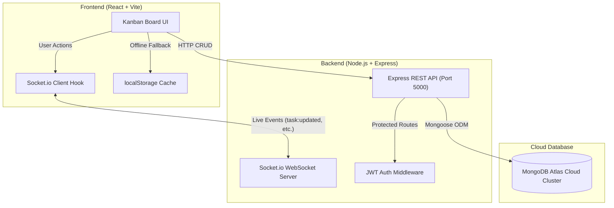

# CollabBoard (SyncBoard)

A real-time, full-stack collaborative Kanban task management web application built for software engineering coursework. Features live multi-user synchronization, multi-project boards, JWT authentication, and persistent cloud storage.

- **Live Web App:** [https://collabboard-fg34.onrender.com/](https://collabboard-fg34.onrender.com/)
- **Backend API:** [https://collabboard-fg34.onrender.com/api](https://collabboard-fg34.onrender.com/api)
- **GitHub Repository:** [https://github.com/sandeepailangasingha/collabboard](https://github.com/sandeepailangasingha/collabboard)
- **Team Reflection:** [docs/team_reflection.md](docs/team_reflection.md)

---

## Project Journey & Milestones

We developed this application incrementally across several milestones:

- **Milestone 1 — Frontend UI & Board Structure:**  
  Built the initial frontend layout using React and Vite. Designed the Kanban board with three core columns (To Do, Doing, Done), created custom modal dialogs for task creation, and implemented dark-themed glassmorphic styling with client-side localStorage state.

- **Milestone 2 — Express REST API & Authentication:**  
  Built the backend server using Node.js and Express. Added user authentication using JSON Web Tokens (JWT) and bcrypt password hashing, implemented initial REST endpoints for tasks, and connected the frontend to communicate with the API.

- **Milestone 3 — Cloud Persistence & Multi-Project Support:**  
  Integrated a live MongoDB Atlas cloud cluster using Mongoose ODM. Expanded the architecture to support multiple project boards (e.g. Project Alpha, Mobile App, E-Commerce) with an interactive project switcher, and added client-side caching to keep the board accessible during brief network drops.

- **Session 5 (Final Launch) — Real-Time Sync, CI/CD & Deployment:**  
  Upgraded the app with Socket.io for live bi-directional updates across teammate screens without page refreshes, created automated integration tests with a green GitHub Actions CI pipeline, containerized the app with Docker Compose, and deployed it to Render.com.

---

## Key Features

- **Multi-Project Management:** Create and toggle between different project boards from the top navbar.
- **Kanban Board:** Move tasks smoothly between columns, with live progress velocity and task counts.
- **Real-Time Collaboration:** When anyone adds, moves, or edits a task, everyone viewing the board sees the update instantly via WebSockets.
- **User Authentication:** Secure signup and login with JWT bearer tokens.
- **Search & Filters:** Search tasks by title or filter by priority level (High, Medium, Low).
- **Offline Resilience:** Cached local storage keeps the board viewable even if the network briefly disconnects.

---

## Tech Stack

| Component | Technology |
|---|---|
| **Frontend** | React 19, Vite, Vanilla CSS, Lucide Icons |
| **Backend** | Node.js, Express.js (REST API) |
| **Real-Time** | Socket.io (WebSockets) |
| **Database** | MongoDB Atlas (Cloud ReplicaSet), Mongoose ODM |
| **Testing** | Node.js Test Runner (`node --test`) |
| **CI/CD** | GitHub Actions |
| **DevOps** | Docker, Docker Compose, Nginx |
| **Cloud Hosting** | Render.com |

---

## System Architecture

The application combines a RESTful API for standard CRUD actions with Socket.io WebSockets for live event broadcasting:



---

## How to Run Locally

You can run the project either using Docker or by running the backend and frontend separately.

### Method 1: Using Docker Compose (Quickest)

Make sure Docker is running on your machine:

```bash
# 1. Clone the repository
git clone https://github.com/sandeepailangasingha/collabboard.git
cd collabboard

# 2. Start the full stack
docker compose up --build
```
- Open `http://localhost:5173` in your browser.
- Backend API runs on `http://localhost:5000/api`.

---

### Method 2: Manual Setup

#### Step 1: Start the Backend
```bash
cd server
npm install
npm start
```
The server starts on port `5000` and connects to the cloud MongoDB Atlas database.

#### Step 2: Start the Frontend
In a new terminal:
```bash
cd client
npm install
npm run dev
```
Open `http://localhost:5173` in your browser.

#### Demo Login Credentials
- **Email:** `sandeepa@example.com`
- **Password:** `password123`

---

## Automated Tests & CI Pipeline

To run the backend integration test suite:
```bash
cd server
npm test
```
These tests verify server health, route protection (401 without token), and JWT authentication.

Our **GitHub Actions CI pipeline** (`.github/workflows/ci.yml`) runs automatically on every push, ensuring all tests pass and frontend builds succeed.

---

## Known Limitations

A few areas planned for future development:
1. **Third-Party Logins:** Currently supports email/password authentication with JWT; OAuth (Google/GitHub) is not yet integrated.
2. **File Attachments:** Tasks support titles, descriptions, assignees, and tags, but direct file uploads (e.g. image attachments to S3) are not yet supported.
3. **Offline Sync Queue:** While boards load from client cache during network drops, changes made entirely offline require reconnecting rather than background queue syncing.

---

## Team Members & Contributions

| Member | Role | Main Contributions |
|---|---|---|
| **Sandeepa Ilangasingha** | Team Lead & Full-Stack Developer | Project coordination, Socket.io real-time engine, Atlas connection, and cloud deployment. |
| **Chandu Meththasooriya** | Backend Developer | REST API routes, task controllers, and CI integration test script. |
| **Nirman Jayarathna** | Full-Stack Developer | Postman collection export, server environment config, and testing. |
| **Yasindu Malshan** | Frontend Developer | Kanban board UI components, project switcher dropdown, and layout. |
| **Lasitha Hansamala** | QA & DevOps | Docker containerization, Dockerfiles, and build verification. |
| **Imera Gajanayaka** | UI/UX & Frontend | Form validation, modal dialogs, and styling polish. |
| **Amara Fernando** | UI/UX Designer | UI design system, color palette, and user interaction flow. |

---

## License
MIT License. Created for university software engineering coursework.